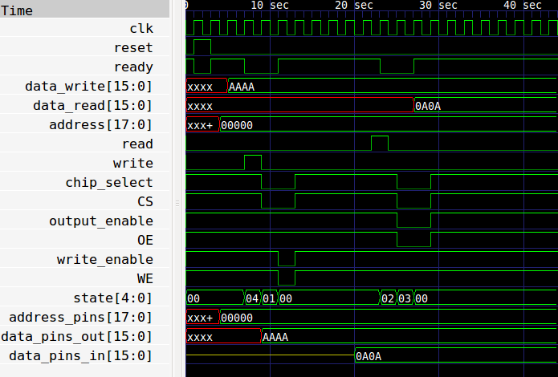

# SRAM on the mystorm blackice

[mystorm](https://mystorm.uk/) blackice has 0.5MByte SRAM on the back of the board

[datasheet for SRAM](ram.pdf)

[mystorm schematic](mystorm.pdf)

From datasheet: ISSI IS62WV25616DALL and IS62/65WV25616DBLL are high-speed, low power, 4M bit SRAMs organized as 256K words by 16 bits. 

## verilog

* extremely simple test of the SRAM
* state machine for read and write
* everything done in 1 cycle as 1 cycle at 12MHz is slower than max read/write
 time of the SRAM.

[sram.v](sram.v)

## current status

* working at 12MHz system clock
* test only reads and writes to first 2^16 words
* bits 14:11 of the data is shown on the boards's 4 leds

## testbench

[sram_tb.v](sram_tb.v)

