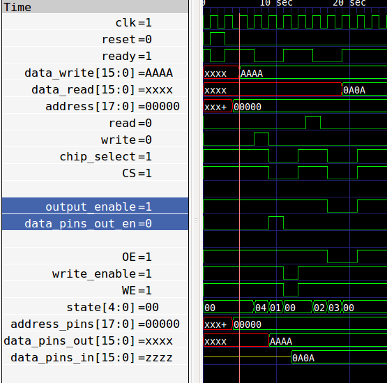

# SRAM on the mystorm blackice

[mystorm](https://mystorm.uk/) blackice has 0.5MByte SRAM on the back of the board

[datasheet for SRAM](http://docs-europe.electrocomponents.com/webdocs/1313/0900766b81313964.pdf)

From datasheet: ISSI IS62WV25616DALL and IS62/65WV25616DBLL are high-speed, low power, 4M bit SRAMs organized as 256K words by 16 bits. 

## verilog

* extremely simple test of the SRAM
* state machine for read and write
* everything done in 1 cycle as 1 cycle at 12MHz is slower than max read/write
 time of the SRAM.

[sram.v](sram.v)

## current status

not working! Need to check with a scope, but I'm assuming the tristate on the
datapins register is not working.

## testbench

[sram_tb.v](sram_tb.v) testbench looks good to me, if I understand the timing diagrams

